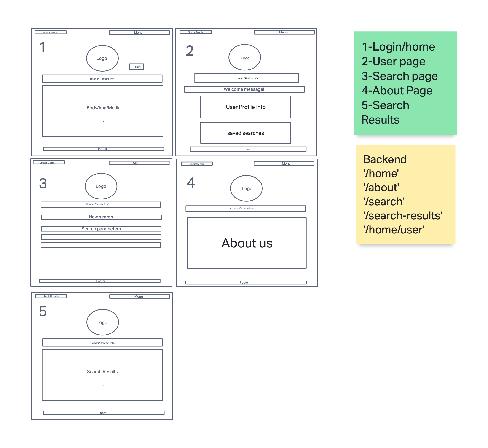
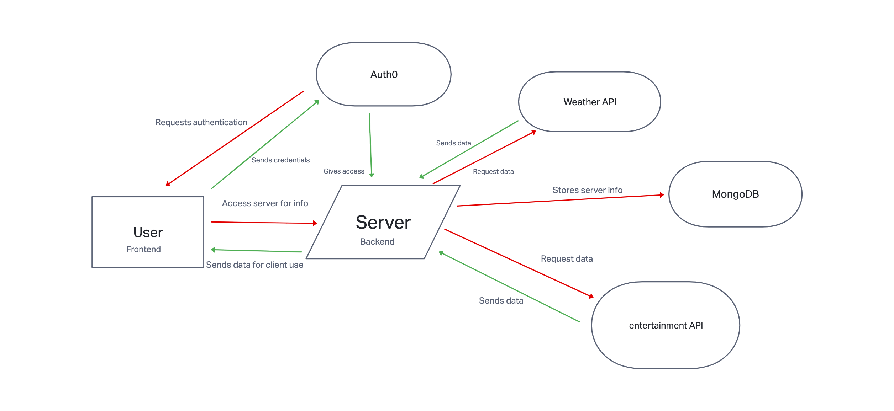

# travel-app-Backend
## Expanding 201 Travel App

### Summary of idea.
- Expand existing travel app from 201, to add and update the following features:
  - Update questions and add/remove destinations, Add weather, Add entertainment and food, What problem or pain point does it solve? 
  - a. Keep it high level without going into too much detail. (3-4 sentences is enough)The app is intended to reduce the stress of vacation planning. It also helps to minimize potential over exposure to the various choices.
Minimum Viable Product (MVP) definition.
- What is the minimum required for you to present on your demo day?
Destination suggestions, Destination forecast, Images, Entertainment Auth0

**Wireframe**

 

**Data Modeling**

